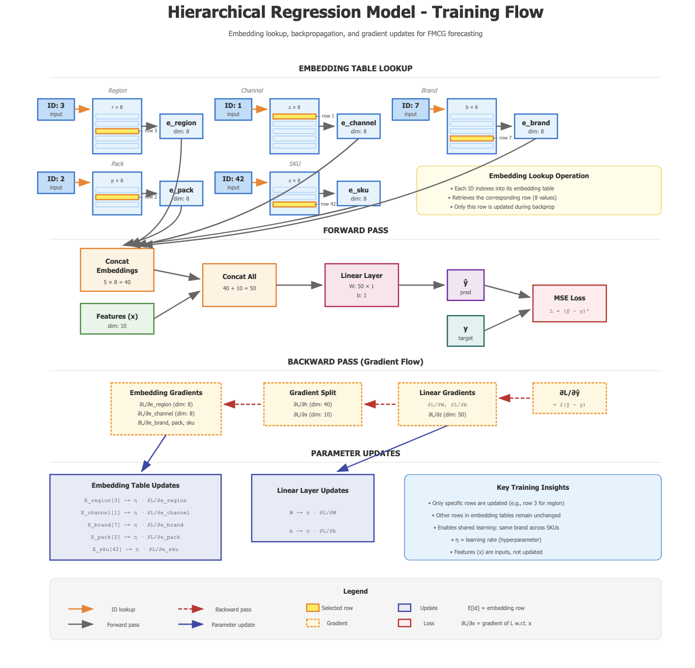

# HiReF (Hierarchical Regression Forecasting)

**HiReF** is a hierarchical forecasting tool designed for FMCG (Fast-Moving Consumer Goods) data. It leverages learned embeddings for hierarchy levels (Region, State, Segment, Brand, Pack) combined with numerical features to predict sales across thousands of SKUs.



## Features

*   **Hierarchical Embeddings**: Learns shared representations for categorical hierarchies to capture cross-SKU patterns.
*   **Hybrid Architecture**: Combines embeddings with numerical features (price, weather, macroeconomics) in a linear model.
*   **Constrained Optimization**: Enforces business logic (e.g., Price must have negative impact) using monotonic constraints on weights.
*   **Smart Initialization**: Initializes bias to target mean to ensure realistic baseline contributions from the start.
*   **Multiplicative Interactions**: Captures complex relationships between hierarchy levels and drivers (e.g., "TV Spend effectiveness varies by Region").
*   **Vectorized Inference**: Fast batch prediction for large datasets.
*   **Interactive Dashboard**: A Dash-based web application to visualize performance, driver importance, and diagnostics.

## Project Structure

```
hier_reg/
├── config.py                    # Configuration settings
├── requirements.txt             # Project dependencies
├── data/                        # Data preprocessing and loading
├── models/                      # PyTorch model definitions
├── training/                    # Training loop and metrics
├── inference/                   # Inference logic
├── scripts/                     # Executable scripts (train, analyze)
└── app/                         # Interactive Dashboard
    ├── app.py                   # Dashboard entry point
    └── ...
```

## Quick Start

The easiest way to get started is to use the provided startup script. This will handle environment setup (using `uv`), data generation, training, and launching the dashboard in one go.

```bash
./start.sh
```

*Prerequisites: You need to have [uv](https://github.com/astral-sh/uv) installed.*

## Installation

If you prefer manual setup:

1.  Clone the repository.
2.  Install dependencies:
    ```bash
    pip install -r requirements.txt
    ```

## Usage

### 1. Training the Model

Train the hierarchical model using the configured data:

```bash
python scripts/train_model.py
```

This will:
*   Preprocess the data.
*   Train the model.
*   Save the model (`outputs/model.pt`) and preprocessor (`outputs/preprocessor.pkl`).
*   Save test metrics (`outputs/results/test_metrics.json`).

### 2. Analyzing Results

Generate comprehensive predictions and contribution analysis:

```bash
python scripts/analyze_results.py
```

This creates `outputs/results/model_results_with_contributions.csv`.

### 3. Running the Dashboard

Launch the interactive dashboard to explore the results:

```bash
python app/app.py
```

Open your browser at [http://localhost:8050](http://localhost:8050).

## Dashboard Features

*   **Overview**: Performance metrics (MAE, RMSE) and error analysis over time.
*   **Driver Analysis**: Visualize feature importance (Driver contributions) with a `Viridis` color scale for better visibility.
*   **Diagnostics**: Investigate baseline distributions and feature correlations.

## Roadmap

*   **Enhanced Synthetic Data Generation**: Improve the data generator to simulate more realistic baseline trends and driver elasticities, creating a more challenging and representative dataset for modeling.
*   **Hyperparameter Tuning & Optimization**: Systematically optimize model hyperparameters (learning rate, embedding dimensions, batch size) to maximize predictive performance.
*   **Advanced Feature Engineering**: Integrate domain-specific transformations such as Adstock (for media carryover), Saturation (diminishing returns), and Power effects to better capture non-linear market dynamics.
*   **Temporal Dynamics**: Incorporate lagged features for both independent variables (e.g., past promotions) and the dependent variable (autoregressive terms) to capture delayed effects and temporal dependencies.
*   **Automated Feature Selection**: Implement techniques to identify the most impactful drivers from a large pool of potential features, reducing noise and improving model interpretability.
